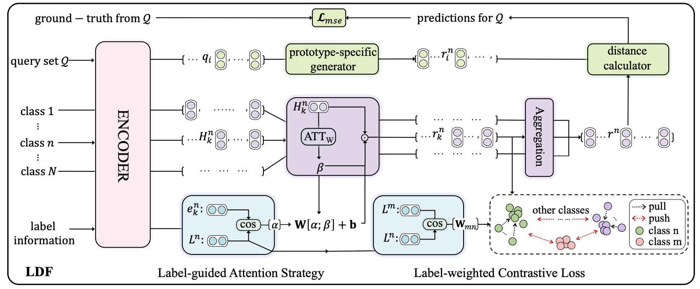
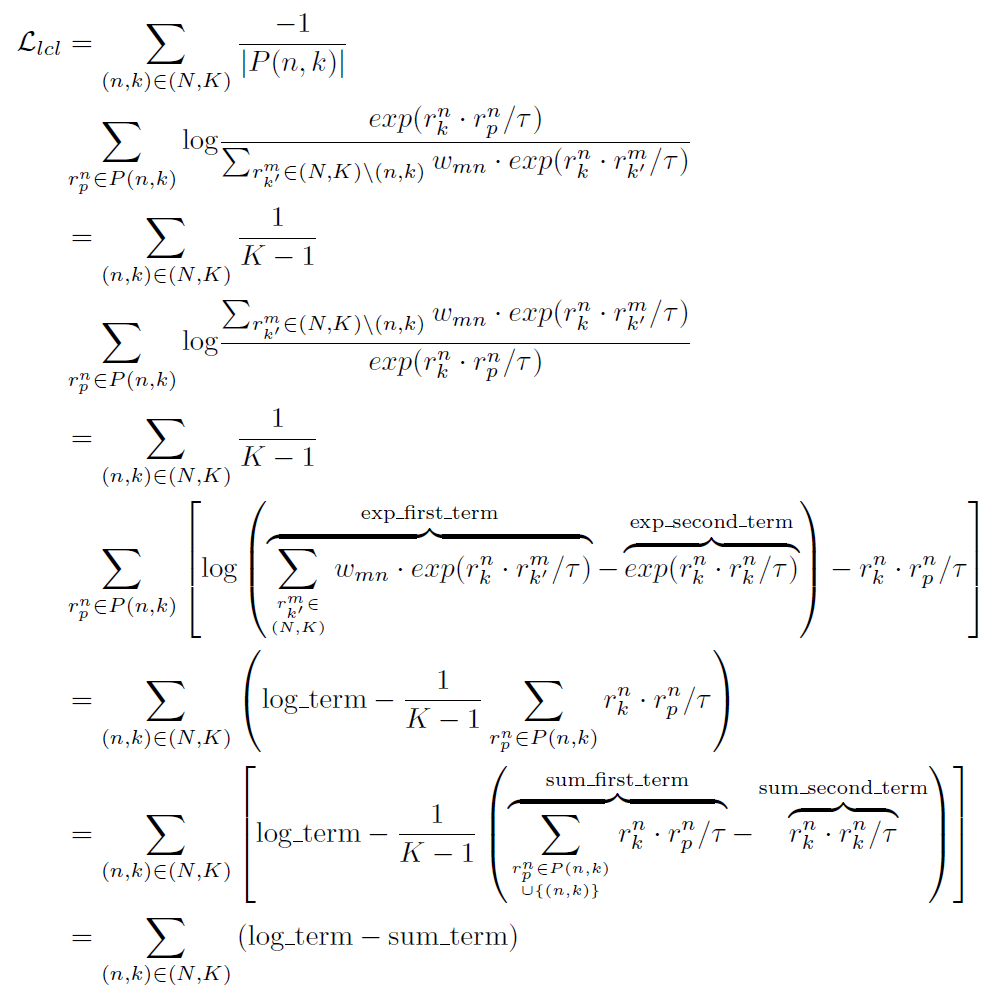

# LDF

Code and data for "[Label-Driven Denoising Framework for Multi-Label Few-Shot Aspect Category Detection](https://arxiv.org/pdf/2210.04220.pdf)" (Findings of EMNLP 2022)

## Overview



- In this paper, we propose a Label-Driven Denoising Framework (LDF) to alleviate the noise problems for the FS-ACD task.
- Label-Driven Denoising Framework contains a label-guided attention strategy to filter noisy words and generate a representative prototype for each aspect, and a label-weighted contrastive loss to avoid generating similar prototypes for
semantically-close aspect categories.

## Setup

### Requirements
```bash
+ python 3.7
+ tensorflow 2.4.0
+ keras 2.4.3
+ sklearn 0.0
+ numpy 1.19.5
```

### Download word embedding
please download the glove.6B.50d embedding in JSON format: [[Link](https://drive.google.com/file/d/1vCm_X2vrSSwLICwmm4NW2-dXfNtV8TFg/view?usp=sharing)], or in txt format: [[StanfordNLP](https://github.com/stanfordnlp/GloVe)] and put it under word_embedding folder

### Model configuration

- you can choose one or multiple methods at one time in the model_list
```bash
e.g., model_list = [None, 'AWATT_LAS', 'LDF_AWATT']

# code:             corresponding model:
#  None             the original AWATT model
# 'AWATT_LAS'       AWATT+LAS
# 'AWATT_LCL'       AWATT+LCL
# 'AWATT_SCL'       AWATT+SCL
# 'LDF_AWATT'       LDF-AWATT
# 'HATT'            the original HATT model
# 'HATT_LAS'        HATT+LAS
# 'HATT_LCL'        HATT+LCL
# 'HATT_SCL'        HATT+SCL
# 'LDF-HATT'        LDF-HATT
```

- you can choose one or multiple datasets at one time in the dataset_list
```bash
e.g., dataset_list = ['FewAsp', 'FewAsp(single)', 'FewAsp(multi)']
```

- you can choose one or multiple configs at one time in the config_list
```bash
e.g., config_list = [[2, 5, 5], [1, 5, 10], [1, 10, 5], [1, 10, 10]]

# [2, 5, 5] stands for: two(2) '5'-way-'5'-shot meta-tasks for two batch-size
# [1, 5, 10] stands for: one(1) '5'-way-'10'-shot meta-task for one batch-size
# [1, 10, 5] stands for: one(1) '10'-way-'5'-shot meta-task for one batch-size
# [1, 10, 10] stands for: one(1) '10'-way-'10'-shot meta-task for one batch-size
```

## Usage

- You can use the following command to train and test LDF on the FS-ACD task:

```bash
python train_and_test.py
```

- The final results can be saved in the excel file you specified:

```bash
e.g., pd.DataFrame(result_list).to_excel('result.xlsx')
```

## Implementation details
- The implementation of Label-weighted Contrastive Loss follows the simplification below:

<div align=center></div>

- For the numeric results in the experiments, we take 5 runs covering seeds [5, 10, 15, 20, 25]. **Different GPUs and versions of Keras/TensorFlow might give different results. Feel free to use our code, re-implement, and re-run the experiments!**

- For the implementation of model [[AWATT](https://aclanthology.org/2021.acl-long.495/)] whose code is not available when we are working on **LDF**, in order to achieve the reported results, our implementation slightly differs from what is described in [[paper](https://aclanthology.org/2021.acl-long.495/)].

## Build your own model
you can augment your own model with **LDF** by: 

- Introduce *label text* into the Attention module to help focus on salient information that benefits classification; 

- Add our Label-weighted Contrastive Loss.

## Citation

If the code is used in your research, please cite the paper:
```bash
@article{zhao2022label,
    title={Label-Driven Denoising Framework for Multi-Label Few-Shot Aspect Category Detection},
    author={Zhao, Fei and Shen, Yuchen and Wu, Zhen and Dai, Xinyu},
    journal={arXiv preprint arXiv:2210.04220},
    year={2022}
}
```
If the data is used in your research, please cite the paper:
```bash
@inproceedings{hu-etal-2021-multi-label,
    title = "Multi-Label Few-Shot Learning for Aspect Category Detection",
    author = "Hu, Mengting and Zhao, Shiwan and Guo, Honglei and Xue, Chao and Gao, Hang and Gao, Tiegang and Cheng, Renhong and Su, Zhong",
    booktitle = "Proceedings of the 59th Annual Meeting of the Association for Computational Linguistics and the 11th International Joint Conference on Natural Language Processing (Volume 1: Long Papers)",
    month = aug,
    year = "2021",
    address = "Online",
    publisher = "Association for Computational Linguistics",
    url = "https://aclanthology.org/2021.acl-long.495",
    doi = "10.18653/v1/2021.acl-long.495",
    pages = "6330--6340",
}
```


